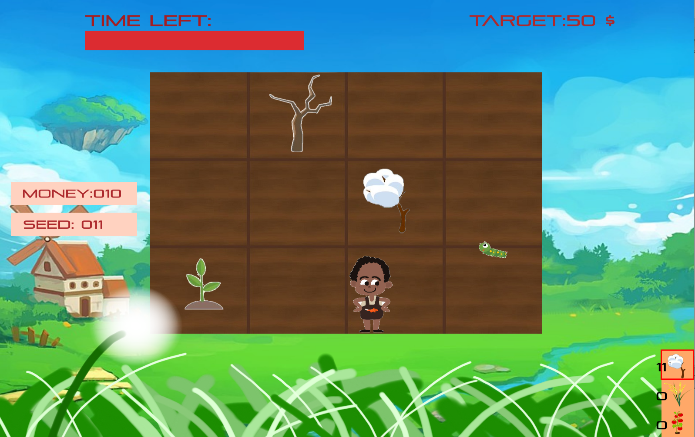

# PlantingGame
<!--  -->


This is my Introduction to Programming I project

## Installation

Make sure that you already have codeblocks, or you can download it [here](https://www.codeblocks.org/)<br><br>

#### Clone this repository. <br><br>
```
git clone https://github.com/blog40813/PlantingGame.git
```


#### Setting<br>

* 基本上都已經設定好了，如果出錯，檢查 codeblocks 的 `setting/complier`

