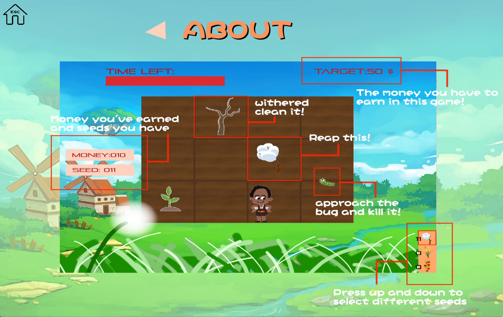
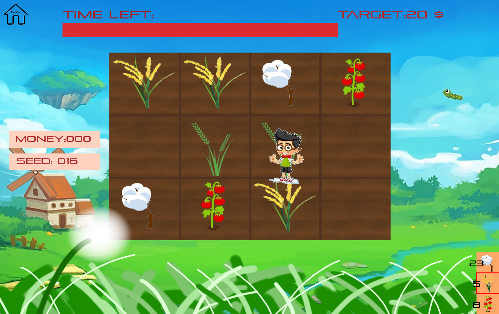

# PlantingGame
<!--  -->


This is my Introduction to Programming I project

## Installation

Make sure that you already have `codeblocks`, or you can download it [here](https://www.codeblocks.org/)<br><br>

#### Clone this repository. <br><br>
```
git clone https://github.com/blog40813/PlantingGame.git
```

#### Setting<br>

* 基本上都已經設定好了，如果出錯，檢查 project 的 `Build options`


* 一開始先將`allegro/include`加入到complier的`search directories` 裡面


* 分別將`liballegro_monolith-debug.dll.a` 以及 `liballegro_monolith.dll.a` 加入到 `debug` 跟 `release` 的 `linker settings`
  ###### (這兩個檔案會在allegro/lib裡面)

  

## Start playing (執行cbp檔)

### 遊戲畫面<br>
<br>

    <br>

######  <p align = left>(過關解鎖更多角色↑)&emsp;&emsp;&emsp;&emsp;&emsp;&emsp;&emsp;&emsp;&emsp;&emsp;&ensp;&ensp;&ensp;(遊戲說明↑)&emsp;&emsp;&emsp;&emsp;&emsp;&emsp;&emsp;&emsp;&emsp;&emsp;&emsp;&emsp;&emsp;&emsp;&emsp;&emsp;(遊戲畫面，多種植物選擇↑)</p> 
<br>

    <br>


######  <p align = left>(商店機制，可購買種子/肥料↑)&emsp;&emsp;&emsp;&emsp;&emsp;&emsp;&ensp;&ensp;&ensp;(過關畫面↑)&emsp;&emsp;&emsp;&emsp;&emsp;&emsp;&emsp;&emsp;&emsp;&emsp;&emsp;&emsp;&emsp;&emsp;&emsp;&emsp;(失敗畫面↑)</p> 
<br>

### 遊戲操作說明<br><br>

`W` `A` `S` `D`：控制游標位置/角色移動<br>
`J`： 種植/商店購買<br>
`K`： 殺死蟲蟲<br>
`L`： 收割作物 (各階段作物皆會消失) <br>
`H`： 變更種植作物 <br>
`P`： 進入商店<br>
`ESC`： 離開<br>
`ENTER`： 確認<br><br>


### 小提醒 <br>
* **1.&nbsp;&nbsp;若手上沒有種子，但擁有金額大於商店種子售價，不會馬上結束遊戲**  <br>
* **2.&nbsp;肥料可加速作物生長速度/減緩枯萎速度(初始值為1，上限3)** <br>
* **3.&nbsp;各個參數可以在cbp檔設定，可以搜尋`Parameter setting`快速找到參數** <br>
* **4.&nbsp;切換作物的按鈕為 `H`** <br><br>


